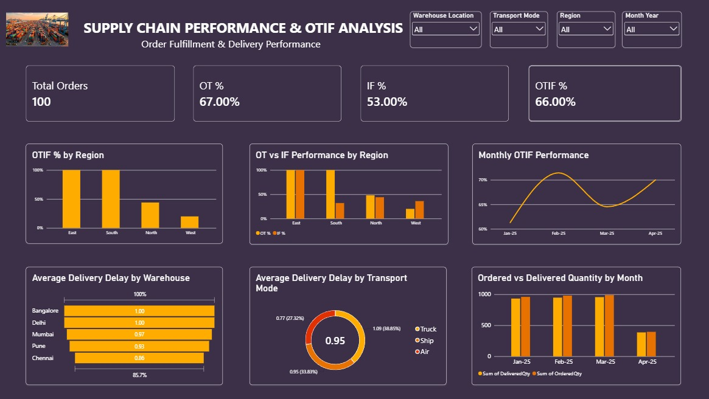

# Supply Chain Performance & OTIF Analysis Dashboard

## Project Overview

A Power BI dashboard developed to analyze supply chain order fulfillment and delivery performance.

The dashboard focuses on key operational KPIs such as On-Time (OT), In-Full (IF), and On-Time In-Full (OTIF) performance.

## Business Problem

Supply chain teams need visibility into order fulfillment performance to understand whether orders are delivered on time and in full.

This dashboard provides an interactive view of fulfillment performance across regions, warehouse locations, transportation modes, and months.

## Objectives

- Monitor total order volume
- Track On-Time (OT) performance
- Track In-Full (IF) performance
- Monitor OTIF performance
- Analyze OTIF performance by region
- Analyze average delivery delays by warehouse
- Compare delivery delays across transport modes
- Monitor monthly OTIF performance
- Compare ordered and delivered quantities

## Tools Used

- Power BI
- Data Visualization
- KPI Reporting
- Dashboard Development
- Supply Chain Analytics

## Key KPIs

| KPI | Value |
|---|---:|
| Total Orders | 100 |
| On-Time (OT) % | 67% |
| In-Full (IF) % | 53% |
| OTIF % | 66% |

## Dashboard Analysis

The dashboard includes:

- OTIF Performance by Region
- On-Time vs In-Full Performance by Region
- Monthly OTIF Performance
- Average Delivery Delay by Warehouse
- Average Delivery Delay by Transport Mode
- Ordered vs Delivered Quantity by Month
- Interactive filters for Warehouse Location, Transport Mode, Region, and Month & Year

## Key Insights

- OTIF performance varies across regions.
- OT and IF performance can be compared to understand different fulfillment gaps.
- Average delivery delays vary across warehouse locations and transport modes.
- Monthly OTIF performance shows variation over time.
- Ordered and delivered quantities can be compared to identify fulfillment gaps.

## Dashboard

## Project Purpose

This project was developed as a portfolio project to demonstrate Power BI dashboard development, KPI reporting, data visualization, and supply chain performance analysis.
